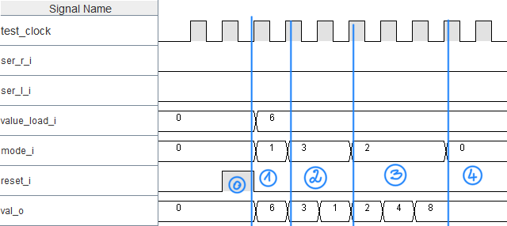

# SYL-LABO-Chenillard
## Question 1
La valeur obtenue à la sortie est: 1000

Chronogramme: 

0) Action du reset

1) Décalage de deux (2) bits vers la droite

3) Décalage de trois bits (3) vers la gauche

4) Action du hold

## Question 2

Chronogramme:

D'après le chronogramme on peut bien voir que le mode HOLD est bioen fonctionnel car il remplit bien son rôle de maintien de la dernière valeur de sortie.

## Question 3

## Question 4

## Question 5

## Question 6

## Question 7

## Question 8

## Question 9

## Question 10

