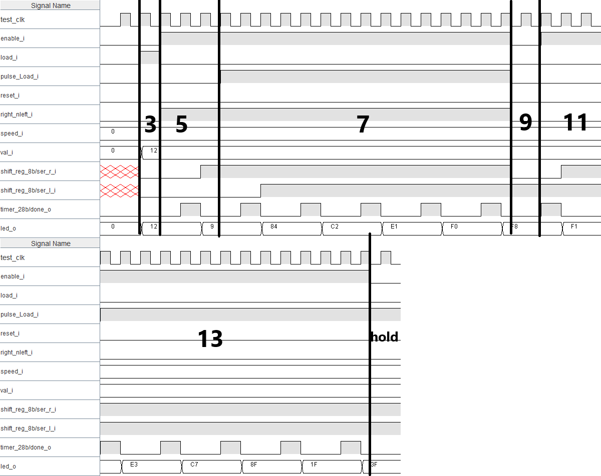

# SYL-LABO-Chenillard
## Question 1
- Valeurs de départ:**0b0110**

- Suite à la deux décalage vers la droite, on obtient: **0b0001** (0110 >> 0011 >> 0001)

- Et apres les 3 décalages vers la gauche, la valeur obtenue à la sortie est  **0b1000** ( 0001 << 0010 << 0100 << 1000)

### Chronogramme 1 

### Legendes:
0) Action du reset

1) Décalage de deux (2) bits vers la droite

3) Décalage de trois bits (3) vers la gauche

4) Action du hold

## Question 2

### Chronogramme 2

1) **Reset** effectué c'est a dire que la valeur de **val_o est remise à 0**

2) Chargement de la valeur **0b0000 0001** sur value_load_i puis selection du **mode_i à 1** pour effectuer le load de la valeur dans le registre, ce qui veut dire que la valeur de val_o est maintenant **0b0000 0001**

3) Ensuite, nous avons mis le **mode_i à 2** pour effectuer un decalage de 1 à gauche de la valeur b0000 0001 et nous avons laisse le clock faire 8 cycles, ce qui nous donne la valeur **0b0000 0000** (**0b0000 0001** << **0b0000 0010** << **0b0000 0100** << **0b0000 1000** << **0b0001 0000** << **0b0010 0000** << **0b0100 0000** << **0b1000 0000** << **0b0000 0000**)

4) Chargement de la valeur **0b1000 0000** sur value_load_i puis selection du **mode_i à 1** pour effectuer le load de la valeur dans le registre, ce qui veut dire que la valeur de val_o est maintenant **0b1000 0000**

5) Ensuite, nous avons mis le **mode_i à 3** pour faire un decalage de 1 à droite de la valeur **0b1000 0000** et nous avons laisse le clock faire 8 cycles, ce qui nous donne la valeur **0b0000 0000** (**0b1000 0000** >> **0b0100 0000** >> **0b0010 0000** >> **0b0001 0000** >> **0b0000 1000** >> **0b0000 0100** >> **0b0000 0010** >> **0b0000 0001** >> **0b0000 0000**)

6) Chargement de la valeur **0b1000 1000** sur value_load_i puis selection du **mode_i à 1** pour effectuer le load de la valeur dans le registre, ce qui veut dire que la valeur de val_o est maintenant **0b1000 0000**

7) Nous avons, ensuite, mis le **mode_i à 3** pour faire un decalage de 1 à droite de la valeur **0b1000 1000** et nous avons laisse le clock faire 3 cycles, ce qui nous donne la valeur **0b0010 0010** ( **0b1000 1000** >> **0b0100 0100** >> **0b0010 0010**) 
 
Finalement nous avons mis le **mode_i à 0** pour faire un hold de la valeur **0b0010 0010**, ce qui nous donne la valeur **0b0010 0010** indemendament du nombre de cycles que nous avons laisse le clock faire.

## Question 3
Les points principaux pour avoir choisit un decompteur à la place d'un compteur sont les suivants:

- **Le décompteur est plus simple à implémenter qu'un compteur** (notre validation est sur une constante, il ya que la valeur de load qui change entre les modes)
- ça nous permet d'eviter le cas ou si la valeur du compteur est changée au cours de route, ça se peut que la limite soit plus basse que la valeur actuelle du compteur, ce qui peut causer des erreurs.

## Question 4
| Fréquence visée    | Nombre de cycle | equivalence 28 bits en hexadecimal |value_i en hexadecimal|
| ------- | ---         | ---------- |--------------|
| 10 MHz  | 3           |0x000 0003  | 0x000 0002   |
| 2.0 Hz  | 15 000 000  |0x0E4 E1C0  | 0x0E4 E1BF   |
| 1.0 Hz  | 30 000 000  |0x1C9 C380  | 0x1C9 C3F7   |
| 0.5 Hz  | 60 000 000  |0x393 8700  | 0x393 86FF   |

## Question 5

L'entrée PULSE_LOAD nous permet de remplacer la valeur de ser_l_i ou ser_r_i (en fonction de right_nleft_i) en un 1.

C'est à dire que si nous avons notre chenillard qui est en mode de décalage à droite, et que nous avons une valeur de  **0b0000 0000**, si nous avons un signal PULSE_LOAD, la valeur du cheniilard sera **0b1000 0000**, puis **0b1100 0000** et **0b1110 0000**... 

## Question 6
La bascule RS nous permet de prende la valeur de PULSE_LOAD (et de la mettre dans l'entrée S) et de la reset soit avec reset_i ou out_lsb (out_msb si right_nleft_i est à 1) dans l'entrée R.

## Question 7
Les priorités de fonctionnement du chenillard sont les suivantes en ordre croissant: **Load, Hold, Shift left, Shift right.**

## Question 8
Table de vérité de **mode_i**

| Load | done_o  | En  | Shift | mode_i(1) | mode_i(0) |
|------|---------|-----|-------|-----------|-----------|
|  0   |   0     |  0  |   0   |     0     |     0     |
|  0   |   0     |  0  |   1   |     0     |     0     |
|  0   |   0     |  1  |   0   |     0     |     0     |
|  0   |   0     |  1  |   1   |     0     |     0     |
|  0   |   1     |  0  |   0   |     0     |     0     |
|  0   |   1     |  0  |   1   |     0     |     0     |
|  0   |   1     |  1  |   0   |     1     |     0     |
|  0   |   1     |  1  |   1   |     1     |     1     |
|  1   |   0     |  0  |   0   |     0     |     1     |
|  1   |   0     |  0  |   1   |     0     |     1     |
|  1   |   0     |  1  |   0   |     0     |     1     |
|  1   |   0     |  1  |   1   |     0     |     1     |
|  1   |   1     |  0  |   0   |     0     |     1     |
|  1   |   1     |  0  |   1   |     0     |     1     |
|  1   |   1     |  1  |   0   |     0     |     1     |
|  1   |   1     |  1  |   1   |     0     |     1     |

## Question 9
Les équations simplifiées de **mode_i(0)** et **mode_i(1)**

Table de karnaugh **mode_i(0)**: 
|   |   |   |   |
|---|---|---|---|
|  0  |  0  |  1  |   1   |
|  0  |  0  |  1  |   1   |
|  0  |  1  |  1  |   1   |
|  0  |  0  |  1  |   1   |

**mode_i(0) = Load + (done_o * En * Shift )**

Table de karnaugh **mode_i(1)**: 
|   |   |   |   |
|---|---|---|---|
|  0  |  0  |  0  |   0   |
|  0  |  0  |  0  |   0   |
|  0  |  1  |  0  |   0   |
|  0  |  1  |  0  |   0   |

**mode_i(1) = /Load * done_o * En**

## Question 10
### Chronogramme 3

### Legendes:
Si un chiffre n'est pas de chronogramme, ça veut dire qu'il est effectué dans la sans coup de clock (ducoup il n'est pas visible sur le chronogramme).
1) Reset effectué c'est a dire que la valeur de val_o est remise à 0
2) Configurer speed_i = "00".
3) Charger la donnée 0x12 à la sortie led_o en introduisant une valeur dans val_i et en activant l’entrée load_i pendant 1 coup de clock.
4) Désactiver le chargement puis activer l’entrée enable_i.
5) Effectuer 3 périodes de Timer avec Right_nLeft_i = ’1’.
6) Appuyer sur Pulse_load_i.
7) Après 5 décalages du chenillard,
8) Désactiver l’entrée enable_i.
9) Changer l’état de Right_nLeft_i pendant 1 coups de clock.
10) Réactiver le chenillard
11) Effectuer 3 périodes de Timer.
12) Appuyer sur Pulse_load_i.
13) Après 5 décalages du chenillard, désactiver l’entrée enable_i
